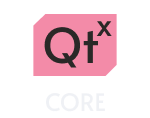
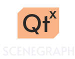
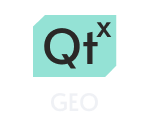
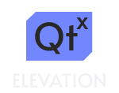
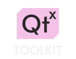
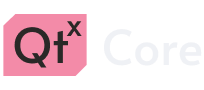

<h2 align="center">
	 
	
	Qt Extensions Library
	 
    
     
    
</h2>

### Library for extending Qt Framework capabilities even further.

## Overview

 

Core module provides useful utilities, such as:

- **Logging**: provides useful extension to Qt logging system - terminal coloring based on message logging level and function/class/namespace tracing.
- **Math**: provides C++20-style numeric constants, math functions such as `lerp`, `clamp` and more.
- **Type aliases**: provides aliases such as `i32`, `usize`, `f64` and Qt-specific aliases such as `String`, `Variant`, `Object`. *This feature can be disabled via CMake option*.
- **Expected and Range-v3**: Core library includes this 3rd-party libraries.

 

Scenegraph library provides Qt Quick Scenegraph extensions:

- **Scenegraph Object**: utility base class for easier node management.
- **Scenegraph Utilities**: conversion functions between `QSGGeometry` types and more.
- **Quick Utilities**: QML singleton which exposes useful function to QML frontend.
- **Materials**: materials pack for scenegraph objects.
- **Gadgets**: gadget classes to use in scenegraph objects.

 

Geo library includes:

- **Google Maps tile provider**: Qt Location extension class for providing Google Maps tiles.
- **Orthodromy**: classes to work with orthodromy.
- **Tile loader**: offline tile downloader from HTTP link to folder.
- **Geo-specific math**: geometry and mathematics on Earth surface

 

Elevation module provides GDAL functions nicely wrapped in C++ code:

- **Elevation at coordinate**: gives ability to get terrain elevation in meters from specified coordinate.
- **Elevation profile**: builds elevation 2D profile from specified polyline.
- **Intersection check**: gives various functions to check given polyline for intersections and more.

